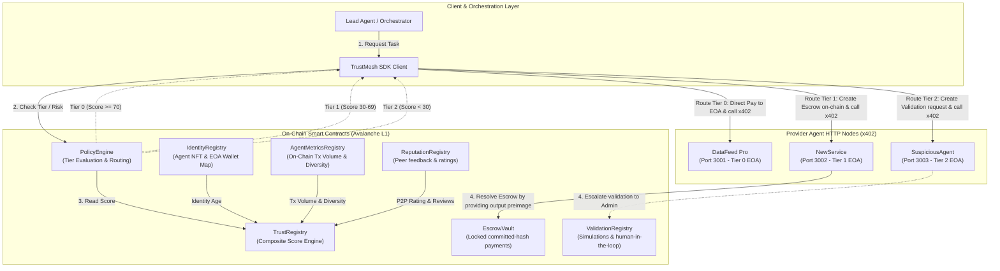
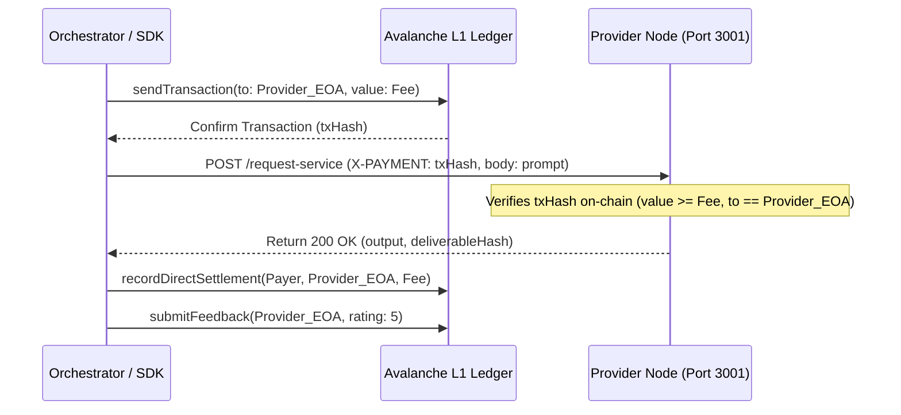
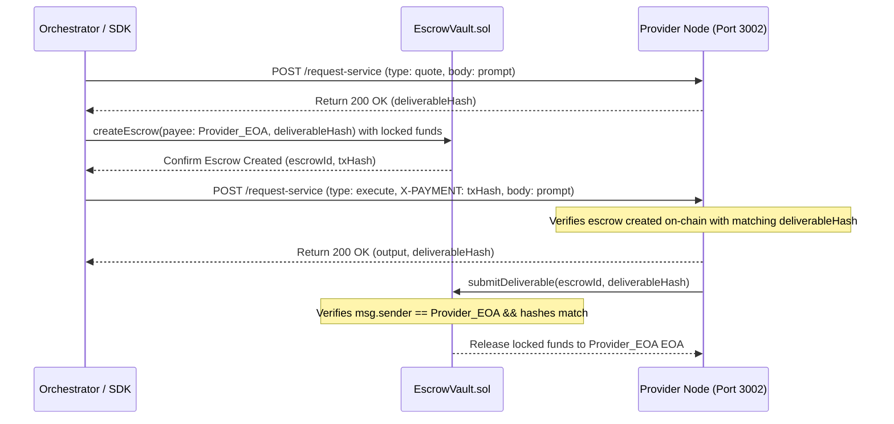
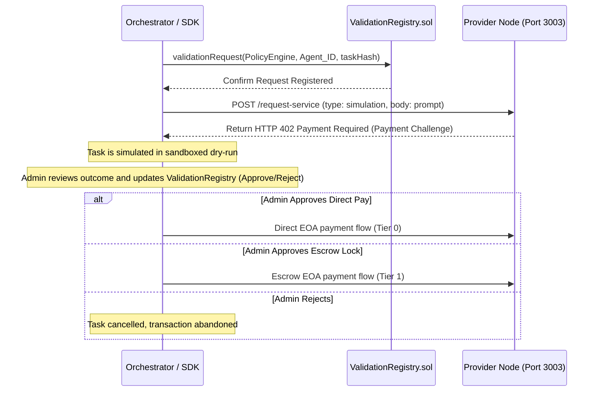

# 🏗️ TrustMesh Architecture & Flow Overview

This document describes the updated architecture of the **TrustMesh Protocol** following the removal of the ERC-6551 Token Bound Account (TBA) layers. The protocol now uses **Direct EOA Wallet Mappings**, simplifying on-chain interactions and improving gas efficiency.

---

## 🗺️ High-Level System Architecture

The following diagram illustrates how the **Orchestrator**, **SDK**, **Smart Contracts**, and **Provider Agents** interact using the **x402 Payment Handshake** and **ERC-8004 registries**:

---

## 🔄 Tiered Payment & Verification Flows (Direct EOA)

Since the Token Bound Account proxies have been removed, the payer SDK interacts directly with the payee's EOA wallet and the provider's HTTP server.

### 🟢 Tier 0: Direct Payment (High Trust, Score $\ge$ 70)
Used when the payee has an established, high-trust on-chain score. 

---

### 🟡 Tier 1: Commit-Lock-Reveal Escrow (Medium Trust, Score 30–69)
Used to secure funds for medium-trust providers. Funds are locked in escrow and only released when the provider reveals the matching content preimage.

---

### 🔴 Tier 2: Validation & Escalation (Low Trust, Score < 30)
Used for unverified or low-trust providers. The task is requested under validation, and simulated first to ensure safety.

