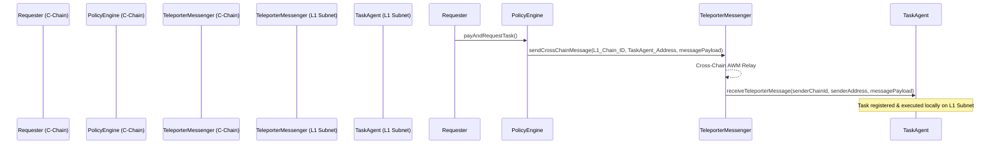

# 🏔️ Avalanche L1 Sandbox Environment Setup

This guide walks you through setting up a **local Avalanche L1 (Subnet) sandbox** with **Teleporter** cross-chain messaging enabled. 

An Avalanche L1 (formerly Subnet) allows you to run a highly customizable, isolated app-chain. By configuring a local L1 sandbox, you can simulate true multi-chain agentic payment scenarios (e.g. paying on the primary C-Chain and validating deliverables on a custom L1).

---

## 🛠️ Prerequisites

1. **Avalanche-CLI**: The command-line utility for creating, deploying, and managing Avalanche L1s.
   * **Windows (via WSL / Linux / macOS)**:
     ```bash
     curl -sSfL https://raw.githubusercontent.com/ava-labs/avalanche-cli/main/scripts/install.sh | sh -s
     ```
     *Ensure the binary is added to your local `PATH`:*
     ```bash
     export PATH=$PATH:$HOME/bin
     ```
2. **Docker**: `avalanche-cli` runs local nodes inside Docker containers to simulate a multi-node cluster. Ensure Docker is running before deploying.

---

## 🏗️ 1. Create Your Custom L1 Configuration

Run the `avalanche blockchain create` wizard to configure a new blockchain named `trustmesh`.

```bash
avalanche blockchain create trustmesh --evm --latest
```

During the wizard, select the following options:
1. **Chain ID**: Enter a custom numeric Chain ID (e.g., `12345`).
2. **Token Symbol**: Enter a custom fee token symbol (e.g., `TMESH`).
3. **Pre-funded accounts**: Choose **Yes** to use the default pre-funded developer addresses.
   * *This pre-funds `0x8db97C7cEcE249c2b98bDC0226Cc4C2A57BF52FC` with 1 million `TMESH` tokens. The private key for this address is:*
     `0x56289e99c94b6912bfc12adc093c9b51124f0dc54ac7a766b2bc5ccf558d8027`
4. **Would you like to enable Teleporter on your VM?**: Select **Yes** (Enables cross-chain messaging).
5. **Would you like to run AWM Relayer when deploying your VM?**: Select **Yes** (Enables message relaying).

Once completed, the configuration files will be generated at `~/.avalanche-cli/subnets/trustmesh/`.

---

## 🚀 2. Deploy the L1 Subnet Locally

To spin up your local network consisting of a primary Avalanche network simulator (C-Chain, P-Chain, X-Chain) and your custom `trustmesh` L1:

```bash
avalanche blockchain deploy trustmesh
```

Once deployment completes, the CLI will output detailed network info. Copy the **Blockchain ID** and the **RPC URL**:
```text
✔ Subnet trustmesh deployed successfully
Blockchain ID:  22eRz...
Local RPC URL:  http://127.0.0.1:9650/ext/bc/22eRz.../rpc
```

---

## ⚙️ 3. Configure Hardhat for Your Local L1

To deploy the TrustMesh contracts onto the custom L1 sandbox, add the network to [hardhat.config.ts](file:///d:/Projects/trust_mesh/hardhat.config.ts):

```typescript
// Add to the 'networks' block in hardhat.config.ts
local_l1: {
  url: "http://127.0.0.1:9650/ext/bc/<YOUR_BLOCKCHAIN_ID>/rpc",
  accounts: ["0x56289e99c94b6912bfc12adc093c9b51124f0dc54ac7a766b2bc5ccf558d8027"],
  chainId: 12345, // Match the Chain ID you configured
}
```

*Substitute `<YOUR_BLOCKCHAIN_ID>` with the value printed by `avalanche blockchain deploy`.*

---

## 🚢 4. Deploy and Seed the L1 Sandbox

You can deploy and seed your local L1 sandbox in one step using our automated helper script. Once your L1 is running via `avalanche blockchain deploy trustmesh`, simply execute:

```bash
npm run l1:setup
```

This script will:
1. Query your local node to auto-discover the Blockchain ID for the `trustmesh` L1 subnet.
2. Automatically save the correct RPC URL and Blockchain ID parameters to your local `.env`.
3. Deploy the ERC-8004 registries and routing engine directly to the local L1.
4. Seed local agent ratings, metrics, and profiles on the L1 chain.

### Manual Alternative (If preferred)

1. **Deploy Contracts**:
   Deploy the ERC-8004 registries and routing engine directly to your local L1:
   ```bash
   npx hardhat run scripts/deploy.ts --network local_l1
   ```
   *This updates [deployed-addresses.json](file:///d:/Projects/trust_mesh/deployed-addresses.json) with L1 contract endpoints.*

2. **Seed Local L1 Fixtures**:
   Seed agent ratings, metrics, and profiles on the L1 network:
   ```bash
   npx hardhat run scripts/seed.ts --network local_l1
   ```


---

## 🤖 5. Run the Multi-Agent Orchestrator on L1

Update your local `.env` variables to tell the orchestrator clients to use your L1 RPC URL:

```env
# In .env
FUJI_RPC_URL="http://127.0.0.1:9650/ext/bc/<YOUR_BLOCKCHAIN_ID>/rpc"
DEPLOYER_PRIVATE_KEY="0x56289e99c94b6912bfc12adc093c9b51124f0dc54ac7a766b2bc5ccf558d8027"
```

Now, launch the agents and execute the orchestrator:

1. **Start Agent Server**:
   ```bash
   npm run agents
   ```
2. **Execute E2E Scenarios**:
   ```bash
   npm run orchestrator -- --scenario=all
   ```

---

## 💫 6. Simulating Cross-Chain Teleporter Messaging (Advanced)

With Teleporter active, you can send cross-subnet messages between the C-Chain (acting as the primary portal) and the `trustmesh` L1 (acting as the execution subnet).

The Teleporter contracts are auto-deployed on both chains at:
* **Teleporter Messenger**: `0x253b5C1C634f439Ea45EBe8b65db9126D0026e6A`
* **Teleporter Registry**: `0x153B5c1c634f439Ea45eBE8B65DB9126d0026E6A`

### Example Teleporter Messaging Workflow

