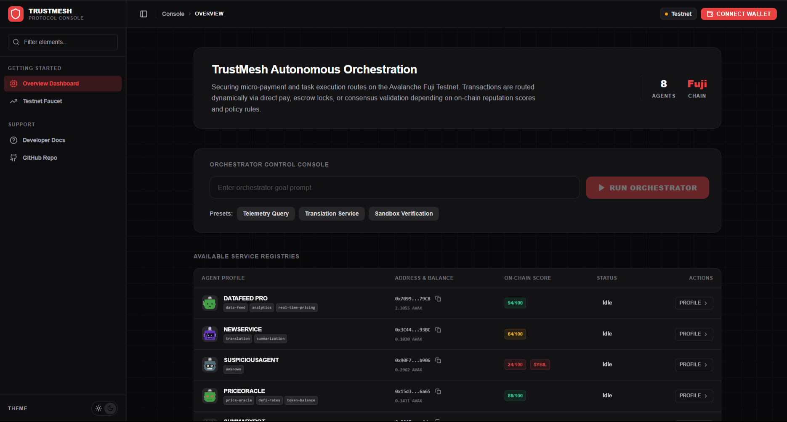
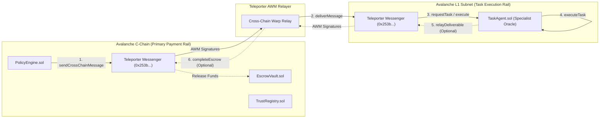

# TrustMesh

TrustMesh is a tiered payment and trust-routing protocol for service providers, agents, and orchestrators.
It combines on-chain trust scoring, escrowed settlement, and simulation-based safety checks into a single
flow that can route each payment to the least risky path available.

The repo is organized as a production-shaped monorepo with smart contracts, shared protocol types, an SDK
foundation, provider agents, an orchestrator, and a dashboard shell. The current implementation focuses on
the core protocol contracts and their tests so the system can be deployed, exercised locally, and extended
without replacing the public API later.



## What TrustMesh Does

TrustMesh decides how a payment should move based on the trust level of the payee:

1. Tier 0: direct settlement for high-trust agents.
2. Tier 1: committed-hash escrow for medium-trust agents.
3. Tier 2: safety simulation and escalation for low-trust or risky agents.

That routing is driven by a composite trust score built from identity age, reputation, settlement history,
counterparty diversity, and Sybil-like transaction patterns.

## Architecture

The diagram below illustrates the TrustMesh protocol layout. It highlights the smart contract layers that calculate trust and enforce payment tiers, the Externally Owned Accounts (EOAs) that act as agent wallets, and the off-chain orchestration that routes requests based on the on-chain data:

```mermaid
graph TD
    %% Components
    subgraph OffChain["Client & Orchestration Layer"]
        Orchestrator["Lead Agent / Orchestrator"]
        SDK["TrustMesh SDK Client"]
        Facilitator["x402 Facilitator Node"]
    end

    subgraph OnChain["On-Chain Protocol Layer (Avalanche Fuji / Local)"]
        IdentityRegistry["IdentityRegistry (Agent NFT & EOA Wallet Mapping)"]
        PolicyEngine["PolicyEngine (Tier Routing)"]
        TrustRegistry["TrustRegistry (Composite Scoring)"]
        MetricsRegistry["AgentMetricsRegistry (Volume & Diversity)"]
        RepRegistry["ReputationRegistry (Feedback)"]
        EscrowVault["EscrowVault (Tier 1 Escrow)"]
        ValidationRegistry["ValidationRegistry (Tier 2 Risk Simulation)"]
    end

    subgraph Providers["Service Provider Agents (with EOA Wallets)"]
        subgraph Agent0Box["DataFeed Pro (High Trust - Tier 0)"]
            Agent0["DataFeed Pro Agent Node"]
            EOA0["Agent EOA Wallet"]
        end
        subgraph Agent1Box["NewService (Medium Trust - Tier 1)"]
            Agent1["NewService Agent Node"]
            EOA1["Agent EOA Wallet"]
        end
        subgraph Agent2Box["SuspiciousAgent (Low Trust - Tier 2)"]
            Agent2["SuspiciousAgent Node"]
            EOA2["Agent EOA Wallet"]
        end
    end

    Faucet["Testnet Faucet"] -->|"Seeds AVAX"| EOA0
    Faucet -->|"Seeds AVAX"| EOA1
    Faucet -->|"Seeds AVAX"| EOA2

    %% Orchestrator & SDK relations
    Orchestrator -->|"1. pay(payee, amount, serviceUrl, prompt)"| SDK
    SDK -->|"2. evaluatePayment()"| PolicyEngine
    PolicyEngine -->|"3. getCompositeScore()"| TrustRegistry
    
    %% Scoring details
    IdentityRegistry -->|"Identity Age & Wallet Map"| TrustRegistry
    MetricsRegistry -->|"Read stats"| TrustRegistry
    RepRegistry -->|"Read feedback"| TrustRegistry

    %% Tier routing execution with x402 payment rail
    SDK -->|"Route Tier 0: pay via x402"| Facilitator
    Facilitator -->|"Settle Payment & Forward Prompt"| Agent0Box
    
    SDK -->|"Route Tier 1: Commit-Lock-Reveal Escrow"| Agent1Box
    SDK -->|"Route Tier 2: Request Validation & Simulate"| Agent2Box

    %% Contract interactions for settlement
    SDK -->|"createEscrow(payee, hash)"| EscrowVault
    SDK -->|"releaseEscrow()"| EscrowVault
    EscrowVault -->|"Releases Funds"| EOA1
    
    SDK -->|"requestValidation(payee, taskHash)"| ValidationRegistry
    Agent2Box -.->|"Validation Alert / Escalation"| ValidationRegistry

    %% Colors and styling
    classDef client fill:#3b82f6,stroke:#1d4ed8,stroke-width:2px,color:#fff;
    classDef contract fill:#10b981,stroke:#047857,stroke-width:2px,color:#fff;
    classDef agent fill:#f59e0b,stroke:#b45309,stroke-width:2px,color:#fff;
    classDef external fill:#7c3aed,stroke:#5b21b6,stroke-width:2px,color:#fff;

    class Orchestrator,SDK,Facilitator client;
    class IdentityRegistry,PolicyEngine,TrustRegistry,MetricsRegistry,RepRegistry,EscrowVault,ValidationRegistry contract;
    class Agent0,Agent1,Agent2,EOA0,EOA1,EOA2 agent;
    class Faucet external;
```



## Current Status

The core features and integrations are fully implemented, tested, and validated:
- **Direct EOA Mappings**: Deployed and seeded agent registry with direct EOA wallet mappings to optimize transaction flows and reduce gas costs.
- **Commit-Lock-Reveal Escrow**: Fully integrated into the SDK and agents server.
- **Gemini Tools**: AI agents dynamically query the blockchain using Gemini Function Calling.
- **Cooperative Scenarios**: All 3 multi-agent scenarios compile and execute successfully.

## Multichain L1 Sandbox Simulation

To support Avalanche's focus on custom L1 subnets, TrustMesh simulates a multichain layout where the payment/reputation core is decoupled from the execution layer using **Teleporter** cross-chain messaging:



For setup and deployment instructions on this multichain configuration, refer to the [L1_SANDBOX.md](file:///d:/Projects/trust_mesh/L1_SANDBOX.md) guide.

## Technology Stack & System Components

TrustMesh is built on a highly modular and type-safe stack spanning smart contracts, lightweight off-chain services, and advanced AI agent models:

### 1. Smart Contract & On-Chain Layer
* **Solidity (^0.8.24)**: Core blockchain business logic. Enforces automated escrow rules, validation requests, trust updates, and reputation feedback.
* **Hardhat**: Local network simulation, compilation, deterministic address seeding, and contract unit-testing framework.
* **Viem**: A modern, lightweight, type-safe TypeScript library for interacting with smart contracts, querying logs, and executing transactions on the Avalanche network.
* **OpenZeppelin Contracts**: Standardized ERC-721 token URI storage libraries for agent identities and `ReentrancyGuard` safety wrappers for the escrow contracts.
* **Agent EOA Wallet Mapping**: Associates each ERC-721 agent identity NFT directly with the agent's active EOA wallet. This simplifies transactions, avoids proxy execution overhead, and dramatically reduces gas fees while maintaining full on-chain identity tracking.

### 2. Off-Chain AI & Server Layer
* **Google Generative AI SDK (`@google/generative-ai`)**: Integrates the `gemini-1.5-flash` model to power autonomous provider agents. Supports simulated oracle responses in environments without key access.
* **Gemini Function Calling (Tools)**: Enables agents to query the Avalanche C-Chain dynamically at runtime using custom JSON tool declarations (`get_tba_balance`, `get_agent_info`). The agent dynamically reads real-time blockchain metrics to format its planning, yield optimization, or auditing responses.
* **Node.js (Native HTTP)**: Lightweight HTTP server implementation for provider agents, avoiding framework overhead to deliver low-latency x402 payment handshakes.
* **TypeScript & Monorepo Workspaces**: Standardizes interfaces across packages (Shared, SDK, Agents, Orchestrator) to guarantee complete alignment between smart contract ABIs and off-chain service payloads.

### 3. Protocol Flow Primitives
* **x402 payment protocol**: A payment standard built on the HTTP 402 status code that rejects service requests with an x402 challenge until the payer presents verifiable on-chain payment proof in the `X-PAYMENT` header.
* **Commit-Lock-Reveal Escrow**: Secures Tier 1 payments by locking AVAX in `EscrowVault` against a Keccak256 hash of the generated deliverable *before* the deliverable is revealed. The agent claims the payment by presenting the matching content.
* **Validation & Human-in-the-Loop**: Routes Tier 2 low-trust payments to an on-chain simulation registry. Suspicious transactions prompt administrator reviews to decide between cancellation or a secured escrow release path.

## Repository Layout

```text
.
├── contracts/                  # Solidity Smart Contracts (Avalanche Fuji / Local Dev)
│   ├── src/
│   │   ├── AgentMetricsRegistry.sol
│   │   ├── EscrowVault.sol
│   │   ├── IdentityRegistry.sol
│   │   ├── PolicyEngine.sol
│   │   ├── ReputationRegistry.sol
│   │   ├── TaskAgent.sol
│   │   ├── TrustRegistry.sol
│   │   └── ValidationRegistry.sol
│   └── test/                   # Hardhat Chai/TypeScript Unit Tests
│       └── *.ts
├── packages/                   # Shared Code & Interfaces
│   ├── shared/                 # Common Types and Hashing Utilities
│   │   └── src/
│   │       ├── hashing.ts
│   │       └── types.ts
│   └── sdk/                    # Client/Node SDK for Blockchain & Protocol Operations
│       └── src/
│           ├── TrustMeshClient.ts
│           ├── runtime.ts
│           └── viemRuntime.ts
└── apps/                       # Execution Environments & Interfaces
    ├── agents/                 # Autonomous Service Providers (LLM Agent Server)
    │   └── src/
    │       ├── cli.ts
    │       ├── server.ts       # Low-latency HTTP server for x402 handshakes
    │       └── dataFeedPro.ts  # Individual agent nodes & profiles
    ├── orchestrator/           # Orchestrator Node (Agent Coordinator & Dynamic Router)
    │   └── src/
    │       ├── cli.ts
    │       └── index.ts
    └── dashboard/              # Next.js Dashboard App for Visualization & Simulators
        └── src/
            ├── context/        # TrustMeshContext State Sync
            ├── layout-client.tsx # Persistent Sidebar/Header Client Frame
            └── app/
                ├── docs/       # Developer Docs & Solidity API routing
                ├── policy/     # PolicyEngine Trust Routing Simulator
                └── page.tsx    # Core Overview Console & Live Event Logs
```

## Protocol Overview

The TrustMesh protocol is implemented across a set of modular smart contracts, each with a specific, isolated responsibility. We recently refactored the architecture to consolidate interfaces and remove legacy boilerplate, leaving a lean set of required components.

### 1. IdentityRegistry & EOA Wallet Mappings

The `IdentityRegistry` serves as the root of trust, minting a unique ERC-721 token for each service provider. Instead of using complex and expensive proxy wallets (like Token Bound Accounts), it maps each agent's identity NFT directly to their active EOA wallet. This maps Agent IDs to wallet addresses on-chain, allowing the SDK and other smart contracts to verify the agent's identity and send funds directly to their primary keys.

### 2. ReputationRegistry

The `ReputationRegistry` stores direct feedback (positive and negative reviews) on agents after task settlement. It tracks the historical quality of interactions and provides a public score and summary for each provider.

### 3. AgentMetricsRegistry

This contract stores settlement metrics for each agent:
- total settled USD volume,
- total settled transaction count,
- micro-transaction count,
- distinct counterparty count.

It only allows authorized settler contracts to write settlement records, ensuring the registry is not mutated arbitrarily.

### 4. TrustRegistry

The `TrustRegistry` contract computes a composite trust score for each agent, combining:
- raw reputation score (from `ReputationRegistry`),
- identity age (from `IdentityRegistry`),
- settled transaction value and counterparty diversity (from `AgentMetricsRegistry`),
along with a Sybil penalty if the transaction mix looks suspiciously concentrated in micro-transactions.

The result is cached for a short TTL to optimize reads.

### 5. PolicyEngine

`PolicyEngine` is the routing layer. It evaluates the trust score from `TrustRegistry` and decides which payment tier should be used:
- Tier 0: Direct settlement.
- Tier 1: Commit-Lock-Reveal Escrow.
- Tier 2: Validation Request.

It emits route decisions that the off-chain SDK uses to enforce the correct payment behavior.

### 6. EscrowVault

`EscrowVault` handles the Tier 1 flow:
- creates escrow with an expected deliverable hash,
- allows the payee to submit the deliverable hash,
- releases funds only on an exact match,
- allows the payer to refund after a timeout window.

This is the contract that enforces secure settlement for medium-trust providers.

### 7. ValidationRegistry

`ValidationRegistry` handles the Tier 2 flow. It routes suspicious or low-trust payments into an on-chain simulation and review queue. The system generates a risk report and waits for human-in-the-loop approval or rejection before proceeding with settlement.

### 8. TaskAgent

A reference implementation representing a Service Provider's on-chain presence. The `TaskAgent` receives routing commands from the Orchestrator, manages service endpoints, and interacts with the other registries to complete tasks. It serves as the primary endpoint for agents interacting with TrustMesh.

## Payment Flows

### Tier 0: Direct Settlement

Tier 0 is used for high-trust agents.
The protocol can settle directly and record the settlement in the metrics registry.

Intended behavior:

- low friction,
- fastest path,
- minimal user intervention,
- on-chain accounting remains visible.

### Tier 1: Escrowed Settlement

Tier 1 is used when the agent is trusted enough to transact but not enough to skip safeguards.
The payer creates escrow, the payee delivers a matching output, and funds are released only if the deliverable
hash matches the committed hash.

This is the safest simple on-chain settlement path.

### Tier 2: Simulated Safety Check

Tier 2 is the safety-first path for lower-trust or suspicious agents.
The real end-state is:

- generate a risk report,
- wait for approval or rejection,
- and only then settle or escalate.

The SDK and orchestrator are being built around this path, but the current repo still treats it as a planned
integration rather than a finished production flow.

## Shared Package

`packages/shared` contains the protocol data model and canonical hashing helpers.

Important shared types:

- `TrustMeshTier`
- `CompositeScoreResult`
- `PaymentEvaluation`
- `PaymentResult`
- `ProviderProfile`
- `TrustMeshClientConfig`
- `TrustMeshEventMap`

Important shared utility:

- `buildCanonicalHash()` for stable, deterministic payload hashing

The shared package is the contract between on-chain logic, the SDK, and app-level orchestration.

## SDK Package

`packages/sdk` contains the `TrustMeshClient` skeleton.
The client is designed to expose a small public API while hiding the tier logic inside a runtime adapter.

The current shape:

- event-driven client using `EventEmitter`,
- `pay()` entrypoint,
- runtime abstraction for tier-specific behavior,
- typed request and result models from the shared package.

The missing piece is the viem-backed runtime implementation that will connect this client to the deployed
contracts and provider services.

## Apps

### Agents

`apps/agents` hosts provider services.
The current CLI starts three deterministic provider instances so the protocol can be exercised with different
trust levels and deliverable behaviors.

The provider server is intentionally simple right now, but the target shape is production-like:

- one configurable server,
- multiple provider profiles,
- deterministic responses for local demos,
- endpoints for identity and service request flows.

### Orchestrator

`apps/orchestrator` is the scenario runner.
It is meant to coordinate full payment flows across providers, contracts, and the SDK.

Current state:

- CLI entrypoint exists,
- scenario parsing exists,
- runtime wiring is still being filled in.

### Dashboard

`apps/dashboard` currently contains protocol label helpers.
The end-state is a live dashboard with:

- provider cards,
- activity feed,
- score/status visualization,
- escalation controls,
- websocket-driven updates.

The label helper keeps the UI language human-friendly by translating anomaly keys into plain English.

## Product Research And Positioning

This section summarizes the product thinking behind TrustMesh.
It is intentionally written as a product brief, not as a marketing claim.

### Problem

Many agent and service-payment systems fail in one of three ways:

1. They treat every provider the same, which creates unnecessary friction for trusted providers.
2. They rely on manual review too early, which makes good providers wait for no reason.
3. They trust providers too easily, which creates exposure to bad output, spoofed agents, or repeated failure.

TrustMesh is designed to split those cases into different settlement paths instead of forcing one policy for
every provider.

### Target Users

The product is aimed at:

- AI agent platforms,
- automated service marketplaces,
- service providers with machine-generated outputs,
- orchestration systems that need trust-aware payments,
- teams that want escrow and escalation without hard-coding bespoke logic for each provider.

### Why This Category Exists

Trust-based payment routing is useful when the system needs to answer questions like:

- Should this provider be paid immediately?
- Should the work be held in escrow until the output matches expectations?
- Should the request go through a safety simulation before any payment is approved?
- How do we keep a provider’s trust score visible while still enforcing payment policy?

Those are product questions, not just contract questions.
The protocol is shaped so the answer can be automated.

### Design Assumptions

The current design assumes that the best protocol is not a single payment mechanism.
Instead, it assumes:

- trust should be measurable,
- risk should change the payment path,
- the path should be visible to the user,
- the path should still be deterministic enough for tests and demos.

### Competitive/Adjacent Landscape

Without claiming exhaustive market research, TrustMesh sits near several adjacent product categories:

- escrow and milestone payment systems,
- trust scoring or reputation systems,
- agent marketplaces,
- simulation or approval layers for risky actions,
- workflow orchestrators for service approvals.

The differentiation is the combination, not any one feature:

- trust scoring is not separate from payment routing,
- escrow is not separate from deliverable validation,
- safety simulation is not separate from payment decisioning,
- the dashboard is not just analytics; it reflects protocol state.

### Product Hypotheses To Validate

The build plan suggests the following hypotheses:

- high-trust providers should close faster when routing is automatic,
- escrow should reduce disputes for medium-trust providers,
- safety simulation should catch risky providers before they receive funds,
- a clear dashboard should reduce operator confusion during escalation,
- deterministic local fixtures make the protocol easier to demo, test, and onboard.

### Why The Repo Uses Deterministic Fixtures

The 94 / 55 / 22 scoring targets in the plan are not arbitrary.
They are demo fixtures meant to prove that the protocol can produce different payment paths from different trust profiles.

That makes the product easier to explain:

- 94 = fast path,
- 55 = escrow path,
- 22 = safety path.

## Local Development

### Requirements

- Node.js `>=22.13.0 <23`
- npm
- a local Hardhat-compatible environment

### Environment Variables

Copy `.env.example` to `.env` and fill in the values you need:

```bash
FUJI_RPC_URL=https://api.avax-test.network/ext/bc/C/rpc
DEPLOYER_PRIVATE_KEY=0xYOUR_PRIVATE_KEY
```

Only set Fuji credentials when you are ready to try external deployment.

### Install

```bash
npm install
```

### Build And Test

```bash
npm run build
npm test
npm run typecheck
```

### Run The Provider Agents

```bash
npm run agents
```

### Run The Orchestrator

```bash
npm run orchestrator
```

### Hardhat Commands

```bash
npm run compile
npm run clean
npm run node
```

### Workspace Builds

```bash
npm run build:shared
npm run build:sdk
npm run build:agents
npm run build:orchestrator
npm run build:dashboard
```

## Testing Strategy

The repo currently uses contract-focused tests to keep the core protocol honest.

Covered today:

- trust-score computation and cache behavior,
- settlement metrics recording,
- escrow creation, release, and refund,
- policy routing and authorized metric writes.

Next layers to add:

- SDK unit tests,
- provider integration tests,
- orchestrator scenario tests,
- dashboard component and event-stream tests,
- deploy/seed smoke tests.

## Deployment

The current Hardhat config includes a Fuji network entry.
Deployment is expected to be environment-driven and deterministic.

Before deploying, provide:

- `FUJI_RPC_URL`
- `DEPLOYER_PRIVATE_KEY`

The intended deployment order is:

1. `AgentMetricsRegistry`
2. `TrustRegistry`
3. `EscrowVault`
4. `PolicyEngine`
5. provider and dashboard runtime wiring

The next production-facing step is to add deploy and seed scripts that emit the addresses and demo fixtures
needed by the SDK and orchestrator.

## Roadmap

### Phase 1: Core Protocol Integration (Completed)

- [x] **SDK Runtime Integration**: Built a robust TypeScript client and Viem-based runtime with retry handling for protocol interactions.
- [x] **Provider HTTP x402 Handshake**: Wired up agent HTTP servers to challenge requests with x402 payment requirements.
- [x] **Orchestrator-to-SDK Connection**: Connected the orchestrator CLI/daemon to the smart contract layer using the SDK runtime.
- [x] **Live Dashboard & Event Subscriptions**: Refactored the dashboard shell into clean routed pages (Overview, Policy, Escrow, Validation, Faucet, Docs) and integrated live Web3 event subscriptions.
- [x] **Deployment & Seeding Automation**: Developed Hardhat deploy and seed scripts supporting local network development and automated Fuji testnet wire-up.
- [x] **Dynamic UI & Motion Enhancements**: Added spring-based framer-motion transitions for quarantine/reputation overlays and sliding drawer assistants, plus borderless layout styling.

### Phase 2: Production Scaling (In Progress)

- [ ] **Live ERC-8004 & Oracle Integrations**: Wire up real-time production identity registries and decentralized reputation aggregators.
- [ ] **Avalanche Teleporter & L1 Simulation**: Support cross-subnet trust routing and Teleporter messaging in multi-chain environments.
- [ ] **Fuji & Beyond Deployment Workflows**: Standardize multi-environment CI/CD deployment pipelines.
- [ ] **Property-Based Testing & Failure-Matrix Coverage**: Expand Hardhat unit test suites with property-based test suites to handle adversarial network conditions.
