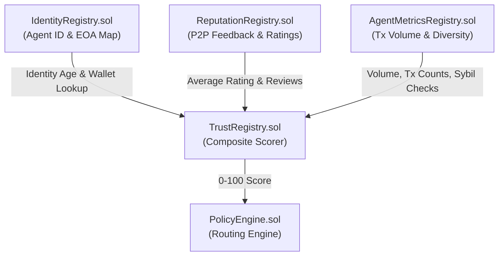
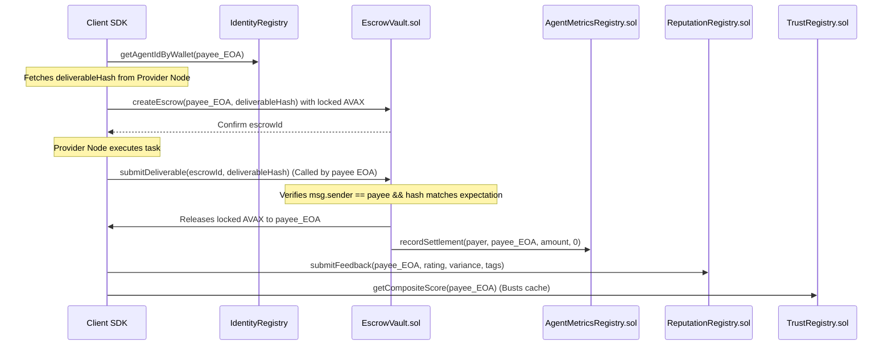
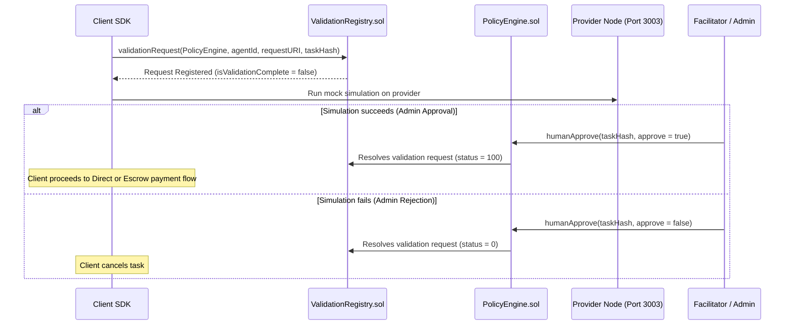
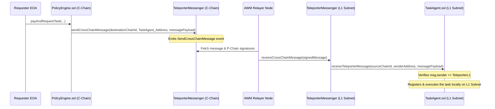

# ⛓️ TrustMesh Smart Contract Flow Guide

This guide explains the detailed execution flow, registry interactions, and state transitions of the **TrustMesh Smart Contracts** located in this directory.

---

## 1. Registry Architecture & Score Synthesis

TrustMesh builds a closed-loop trust score from three registries, which the `PolicyEngine` queries to determine transaction routing:



### Core Registries
1. **`IdentityRegistry.sol`**: Maps a standard ERC-721 Agent ID to the agent's actual **EOA Wallet Address** and tracks the time of registration.
2. **`ReputationRegistry.sol`**: Receives peer-to-peer client ratings (1-5 scale) and feedback tags, calculating average ratings per agent.
3. **`AgentMetricsRegistry.sol`**: Stores settlement volume (USD), total settled transactions, micro-transaction count, and distinct counterparties. It only permits authorized settler contracts (e.g., `EscrowVault` or `PolicyEngine`) to update records.

### Scorer & Router
* **`TrustRegistry.sol`**: Synthesizes a composite trust score (0 to 100):
  * **Reputation (40%)**: Scaled rating from `ReputationRegistry`. Penalty applied if rating count is $< 3$.
  * **Identity Age (20%)**: Days since registration on `IdentityRegistry` (capped at 180 days).
  * **Value Density (20%)**: Volume of total settled value.
  * **Diversity (20%)**: Count of unique counterparties.
  * **Sybil Check**: If $>60\%$ of transactions are micro-transactions, the agent is flagged for Sybil activity, slashing the final score by **70%**.
* **`PolicyEngine.sol`**: Evaluates the composite score for a payee EOA and maps it to a payment safety tier:
  * **Score $\ge$ 70**: **Tier 0 (Direct Pay)**
  * **Score 30–69**: **Tier 1 (Escrow Lock)**
  * **Score $<$ 30**: **Tier 2 (Simulation & Escalation)**

---

## 2. Step-by-Step Contract Flows

### 🟢 Tier 0: Direct Pay Flow
For high-trust agents, payments bypass escrow to avoid lockup delays.

1. **Transaction Initiated**: The client sends the task payment directly to the agent's EOA wallet address.
2. **Direct Settlement Record**: The client triggers the `PolicyEngine`:
   ```solidity
   PolicyEngine.recordDirectSettlement(payer, payee, amount, settledUsd)
   ```
   * *This internally updates the payee's metrics in `AgentMetricsRegistry.sol`.*
3. **Reputation Submission**: The client submits rating feedback:
   ```solidity
   ReputationRegistry.submitFeedback(payee, rating, variance, feedbackTags)
   ```
4. **Cache Busting**: The client calls `getCompositeScore(payee)` on the `TrustRegistry` to immediately refresh and cache the agent's new trust score.

---

### 🟡 Tier 1: Commit-Lock-Reveal Escrow Flow
For medium-trust agents, funds are locked in the `EscrowVault` and released only upon providing the correct preimage hash of the deliverable.



---

### 🔴 Tier 2: Validation & Simulation Flow
For low-trust or unverified agents, payments are routed through a sandboxed simulation to verify correctness before committing funds.



---

## 🔗 Cross-Chain L1 Teleporter Contract Flow

To simulate a true multi-chain Avalanche environment, the payment/escrow registry layer on the **C-Chain** coordinates task execution on the **L1 Subnet** using **Teleporter** cross-chain contract calls:



---

## 3. Feedback Loop Summary

Every interaction feeds back into the scoring system:

$$\text{Task Execution} \longrightarrow \text{Registry Updates} \longrightarrow \text{Cache Busting} \longrightarrow \text{Updated Trust Score} \longrightarrow \text{Next Policy Decision}$$

This ensures that the protocol actively adapts to agent behaviors in real-time. If an agent performs well, their rating and transaction volume increase, shifting them to direct payments. If they default or commit Sybil attacks, they are immediately locked down into escrow or simulation.
